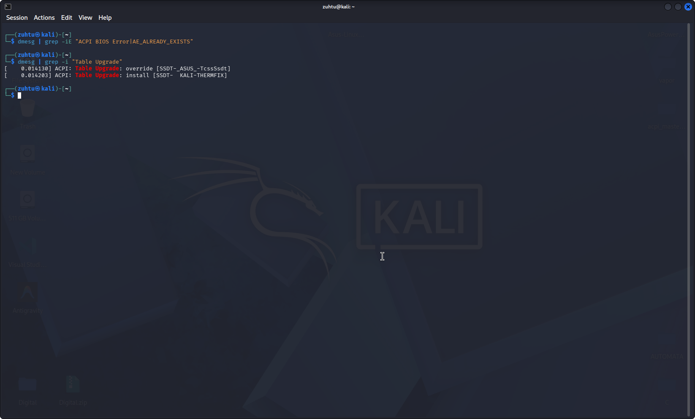

# Asus Linux ACPI Fixes

[](https://opensource.org/licenses/MIT)
[](https://www.linux.org/)

This repository provides modular ACPI patches to resolve common hardware-level bugs on Asus laptops running Linux (Kali, Debian, Ubuntu, etc.). Specifically, it addresses the **Shutdown/Suspend hang** caused by USB-C (TXHC) namespace collisions and **Thermal Sensor** errors in dmesg.

---

## 🔍 Issues Addressed

### 1. USB-C / Thunderbolt Namespace Collision (TXHC)
* **Symptom:** System hangs or freezes at the logo screen during shutdown, restart, or suspend.
* **Root Cause:** A namespace collision (`AE_ALREADY_EXISTS`) where the BIOS attempts to redefine existing USB-C Root Hub methods.
* **Solution:** An override SSDT table with a higher revision (`0x3000`) that bypasses conflicting methods.

### 2. EC0 Thermal Sensor Missing Symbols (EC0T)
* **Symptom:** Flooded dmesg logs with `AE_NOT_FOUND` errors regarding thermal thresholds.
* **Root Cause:** Missing global thermal variables (`S1CT`, `S1HT`, etc.) required by the Embedded Controller (EC0).
* **Solution:** Injecting the missing thermal variables into the global namespace.

---

## 📸 Proof of Work

| Issue Type | Before Patch (Errors) | After Patch (Fixed) |
| :--- | :--- | :--- |
| **TXHC Fix** |  |  |
| **EC0 Fix** |  |  |

---

## 🚀 Installation

### Prerequisites
You need `iasl` (Intel ACPI Compiler) and `cpio` installed:

```bash
sudo apt update && sudo apt install iasl cpio
```

### Automated Setup
1. Clone the repository:
```bash
git clone [https://github.com/zuhtuEren/Asus-Linux-ACPI-Fix.git](https://github.com/zuhtuEren/Asus-Linux-ACPI-Fix.git)
cd Asus-Linux-ACPI-Fix/scripts
```

2. Run the installer:
```bash
chmod +x install.sh
./install.sh
```

**Note:** The script will prompt you to choose the patches and generate an `.img` file (e.g., `acpi_fixed.img`) in the project root.

### Finalizing (GRUB)
1. Copy the generated image to `/boot`:
```bash
sudo cp ../acpi_fixed.img /boot/
```

2. Edit `/etc/default/grub`:
Add the following line (use the filename generated by the script):
`GRUB_EARLY_INITRD_LINUX_CUSTOM="acpi_fixed.img"`

3. Update and reboot:
```bash
sudo update-grub && sudo reboot
```

---

## 🛠 Project Structure

* `src/`: Human-readable ACPI Source Language (`.dsl`) files.
* `bin/`: Compiled AML (`.aml`) files ready for injection.
* `scripts/`: Automation tools for installation (`install.sh`) and cleanup (`uninstall.sh`).
* `docs/`: Technical logs and visual evidence of the fixes.

---

## 🗑 Uninstallation
To remove the patches and revert to stock BIOS behavior:
```bash
cd scripts
sudo chmod +x uninstall.sh
sudo ./uninstall.sh
```

---

## ⚠️ Disclaimer
> **Warning:** Modifying ACPI tables is a low-level operation. While these patches are tested, they involve hardware-level overrides. Use at your own risk. Always keep a Live USB handy to revert changes if your system fails to boot.

---

## 👨‍💻 Author
**Zühtü Eren İncekara** - *Computer Engineering Student & Linux Enthusiast* - [GitHub](https://github.com/zuhtuEren)
